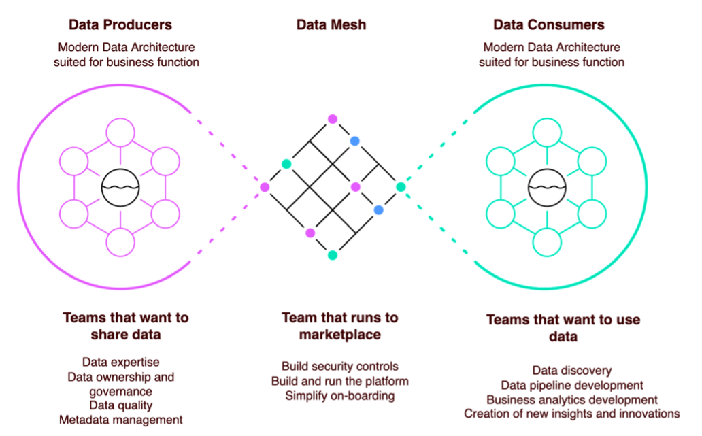

## Harbor DataMesh architecture implementation

### What is data mesh?
Data mesh is a modern data architecture to facilitate governance and data sharing across logical or physical governance boundaries to create Data Domains aligned to LOBs (lines of business). There are 3 major goals. The following are considerations:
1) Data producers own their information lifecycle, determine which datasets are suitable for publication to consumers. 
2) Data domain producers expose datasets to the rest of the organization by registering them with a central catalog. 
3) Data domain consumers or individual users should be given access to data through a supported interface. 
4) All data assets are easily discoverable from a single central data catalog. 
5) All actions taken with data, usage patterns, data transformation, and data classifications should be accessible through a single, central place.

### what is this?
A data catalog management solution, built on top of AWS Lake Formation and AWS Glue with backend services interacting with them. It simplified the effort to implement a Data Mesh architecture on AWS Lake Formation, and provide a friendly and easy-to-use central workplace to register, view, share, subscribe, audit and access the data catalog data within the organization. The portal can be deployed in external customers' AWS account or internal account for AWS internal users, as a web server workload. It can be integrated with customers' external users and identity management system(such as LDAP,  Active Directory, Isengard etc.). It provides different views for roles, such as producers, consumers and central admins. For instance, the producer can create a workflow to onboard the new dataset, and admin will receive and approve the approval in the portal, and the portal will revoke APIs to create the catalog and grant permission automatically.  The consumers can browse and search for catalog data in a data market, then subscribe to the data similar to placing an order on Amazon online store, and they can access the underlying data via any other AWS data analytic services such as Athena, Redshift or Sagemaker after the data owners or admins have approved the subscription.

### Who is Harbor for?
Harbor is for external customers or internal teams who are using or intending to build modern cloud native data platforms using AWS Glue or AWS Lake Formation. For producers such as data owners,  data engineers in specific domains, who create the data and share with other domains, Harbor makes it easy to register and manage all dataset sharings from a single place. For consumers such as data analysts, BI engineers, data scientists in other domains, Harbor provides an inventory of all dataset, associated metadata for browsing, searching, and subscription. For Admins, Legal and compliance, Harbor provides central visibility of permissions, sharing links, and user activity logs, making it easy to audit data security

### What are the benefits of Harbor?
1)	It makes data sharing more manageable as: 
•	It provides a central workplace with Dashboard to track the data sharing in the organization. And also provides Data SLA analysis to monitor underlying data availability.
•	It provides workflow to manage the catalog creation/alter/schema update/subscribe process.
•	It provides fine-grained permission control by TF-Tag method joint with named resource method, which gives sensitive data classify and access control.
•	It aggregates all the sharing relations in a single place, provides better visibility of data security.
2)	It makes data sharing more efficient as: 
•	It automates the implementation of data mesh by wrapping the API calls to the AWS native service rather than manual operation in AWS console. 
•	It provides a friendly and easy-to-use central portal to register, browse, search, subscribe and access the data. 
3)	It makes data sharing more discoverable as: 
•	it provides a data market, in which consumers can browse and search for catalog data, then subscribe to the data similar to placing an order on Amazon online store. 

### What does a Data Mesh look like on AWS?
The following is the demonstration of Data Mesh on AWS using native analytics services. 
- Using AWS Lake Formation to build a lake house architecture as it can repeat and scale data mesh design. The permission sharing and data access are separated, while the underlying data itself still resides in producer account and maintained by itself. 
- The central portal in central account is only responsible for the sharing and management of catalog information,  does not store any underlying data. 
- The consumers in consumer account accesses the data through the shared catalog information and related authorization, without the need to replicate the data

### workflow

### Mockup
1.	Central Admin view – Dashboard  

2.	Central Admin view – sharing relation detail  

3. Central Admin view – approve a subscribe request from consumer  

4.	Producer view – onboard a new data catalog  

5.	Consumer view – data market  

6.	Consumer view – Subscribe a database/table/columns  
